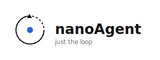
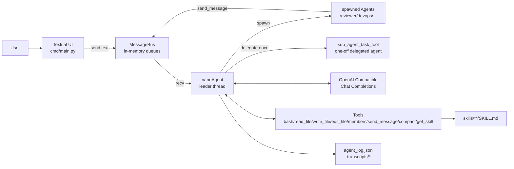
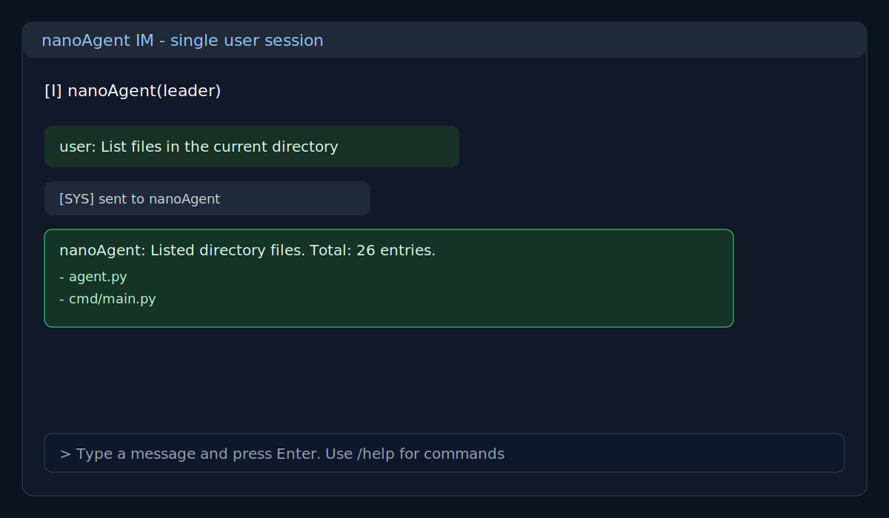
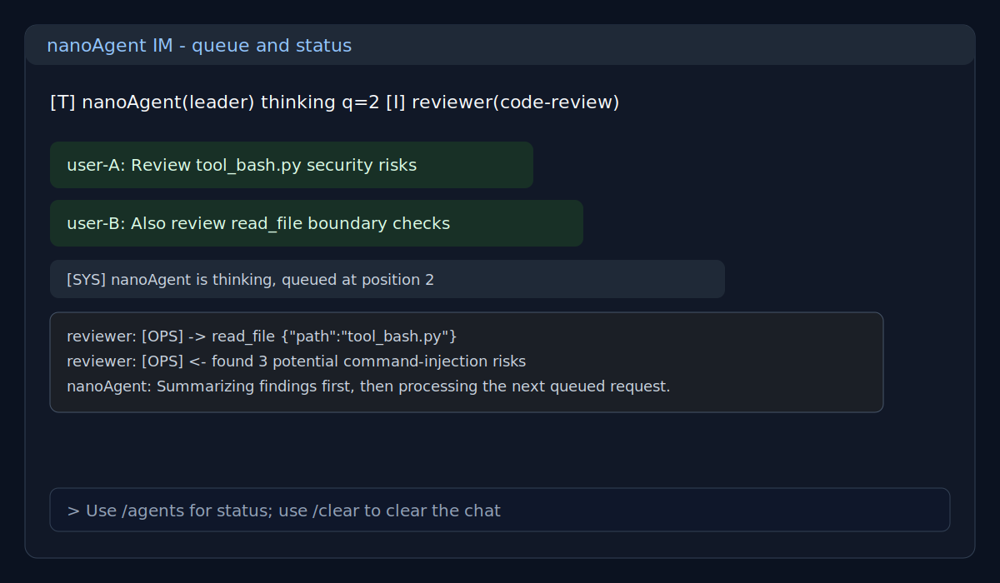
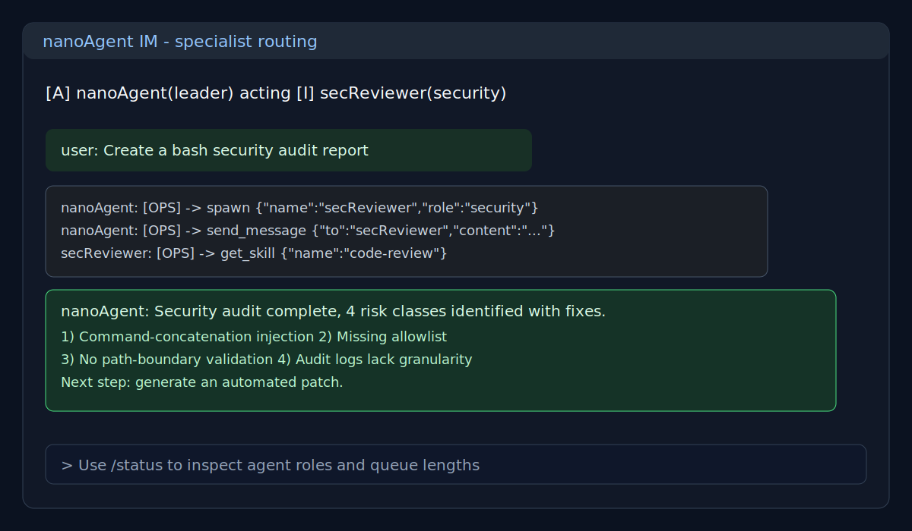

# nanoAgent



A multi-agent terminal collaboration experiment built on OpenAI-compatible Chat Completions.

This version focuses on three goals:

- The leader agent (nanoAgent) receives requests and orchestrates execution
- Persistent specialist agents can be spawned on demand
- Each task supports multi-round tool-call loops until a final response is produced

## Core Features

- Textual-based terminal IM interface
- In-memory message bus (thread-safe Queue)
- Agent state visibility (idle/thinking/acting)
- Pluggable tool registry with profile-based assembly
- On-demand Skill loading from skills/\*\*/SKILL.md
- Conversation compaction and structured logging

## Quick Start

### Requirements

- Python 3.11+
- Environment variable ARK_API_KEY

### Install and Run

```bash
python3 -m venv .venv
source .venv/bin/activate
pip install -e .
export ARK_API_KEY="your_api_key"
python cmd/main.py
```

Exit with quit, exit, or /quit.

## Usage

After startup, all plain text messages are sent to nanoAgent (leader).
nanoAgent chooses one of the following strategies:

- Handle the request directly
- Route to an online specialist
- Spawn a specialist first, then route
- Use sub_agent_task_tool for a one-off delegated task

### Built-in Commands

- /help: Show command help
- /agents or /status: Show online agents, roles, states, and queue lengths
- /clear: Clear the chat area
- /quit: Exit the app

## Architecture Diagram



## Runtime Flow

1. The user enters a message in the UI.
2. The UI sends the message to nanoAgent via the message bus queue.
3. nanoAgent reads it from the queue and appends it to context.
4. nanoAgent starts a streaming LLM call; if tool calls are returned, tools are executed and tool results are fed back.
5. The loop continues until no more tool calls are returned.
6. The UI renders state changes, tool activity, and replies in real time.

## Project Structure

- agent.py: Agent loop and tool-call execution
- agent_context.py: Context and model parameter container
- agent_factory.py: Unified agent construction
- agent_profile.py: System templates and profile-based tool assembly
- agent_logger.py: LLM step logging
- cmd/main.py: Textual UI entry point
- events.py: Lightweight event bus
- tool.py: Tool abstraction
- tool\_\*.py: Tool implementations
- skills/: Skill directory

## Tools

- bash
- read_file
- write_file
- edit_file
- members
- send_message
- spawn
- sub_agent_task_tool
- get_skill
- compact

## Runtime Artifacts

- agent_log.json: latest structured run log
- .transcripts/transcript\_\*.jsonl: compact-generated transcript archives

## Screenshots

Three SVG terminal screenshots are included:

### 1) Single user request



### 2) Multiple queued requests and status



### 3) Leader dispatching a specialist



## Known Limitations

- bash currently has only basic risk filtering and is not a sandbox
- File tools do not yet enforce strict workspace-boundary checks
- run_loop uses a fixed 3-second polling interval
- End-to-end and tool-level test coverage is still limited

## Suggested Next Steps

1. Add path normalization and workspace-boundary enforcement for file tools
2. Add an allowlist mode for bash
3. Add a minimal E2E smoke test and core tool unit tests
