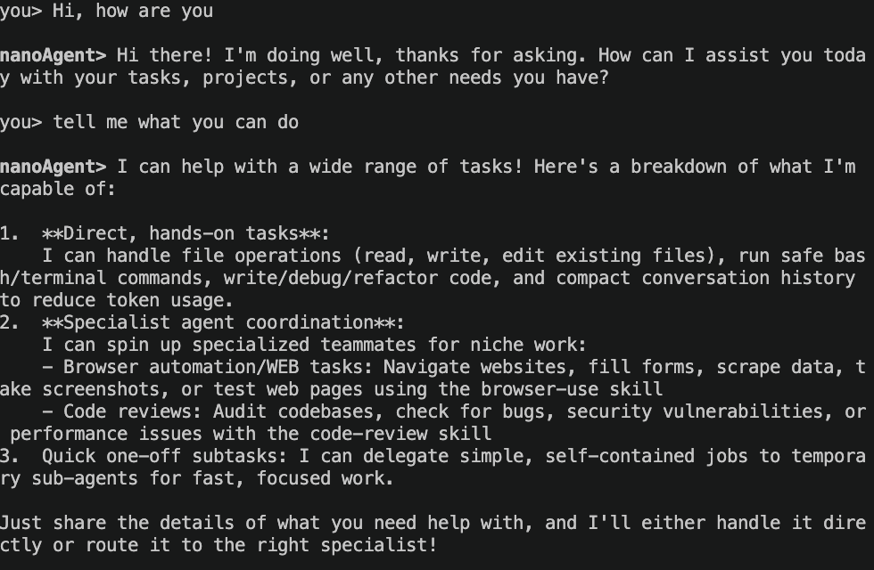

# nanoAgent


The minimal agent framework for research and experimentation.

This version focuses on three goals:

- The leader agent (nanoAgent) receives requests and orchestrates execution
- Persistent specialist agents can be spawned on demand
- Each task supports multi-round tool-call loops until a final response is produced

## Quick Start

### Requirements

- Python 3.11+
- Environment variable OPENAI_API_KEY (for Volcengine API)

### Install and Run

```bash
python3 -m venv .venv
source .venv/bin/activate
pip install -e .
export OPENAI_API_KEY="your_api_key"
python main.py
```

Exit with quit, exit, or Ctrl+C.

## Usage

After startup, all plain text messages are sent to nanoAgent (leader).
nanoAgent chooses one of the following strategies:

- Handle the request directly
- Spawn a specialist first, then route
- Use sub_agent_task_tool for a one-off delegated task



## Tools

- bash: Execute shell commands
- read_file: Read file contents
- write_file: Write to files
- edit_file: Edit existing files
- list_agents: List online agents
- send_message: Send messages to other agents
- spawn: Spawn new specialist agents
- sub_agent_task_tool: Delegate one-off tasks
- get_skill: Load specialized knowledge
- compact: Compact conversation history
