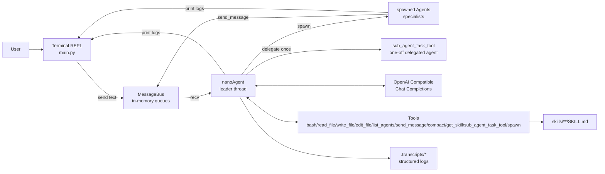

# nanoAgent


the minimal agent framework for research and experimentation.

This version focuses on three goals:

- The leader agent (nanoAgent) receives requests and orchestrates execution
- Persistent specialist agents can be spawned on demand
- Each task supports multi-round tool-call loops until a final response is produced

## Core Features

- Simple terminal REPL with stdout logging
- In-memory message bus (thread-safe Queue)
- Agent state visibility (idle/thinking/acting)
- Pluggable tool registry with profile-based assembly
- On-demand Skill loading from skills/\*\*/SKILL.md
- Conversation compaction and structured logging

## Quick Start

### Requirements

- Python 3.11+
- Environment variable OPENAI_API_KEY (for Volcengine API)

### Install and Run

```bash
python3 -m venv .venv
source .venv/bin/activate
pip install -e .
export OPENAI_API_KEY="your_api_key"
python main.py
```

Exit with quit, exit, or Ctrl+C.

## Usage

After startup, all plain text messages are sent to nanoAgent (leader).
nanoAgent chooses one of the following strategies:

- Handle the request directly
- Route to an online specialist
- Spawn a specialist first, then route
- Use sub_agent_task_tool for a one-off delegated task

### Built-in Commands

- quit/exit: Exit the app
- Ctrl+C: Exit the app

## Architecture Diagram



## Runtime Flow

1. The user enters a message in the terminal.
2. The REPL sends the message to nanoAgent via the message bus queue.
3. nanoAgent reads it from the queue and appends it to context.
4. nanoAgent starts a streaming LLM call; if tool calls are returned, tools are executed and tool results are fed back.
5. The loop continues until no more tool calls are returned.
6. Agents print tool activity, state changes, and replies directly to stdout.

## Project Structure

- main.py: Terminal REPL entry point
- agent.py: Agent loop and tool-call execution
- agent_context.py: Context and model parameter container
- agent_factory.py: Unified agent construction
- agent_profile.py: System templates and profile-based tool assembly
- agent_logger.py: LLM step logging (not currently used)
- client.py: OpenAI client setup
- config.py: Configuration and environment variables
- tools/: Tool implementations
  - tool.py: Tool abstraction
  - tool_bash.py: Bash command execution
  - tool_read_file.py: File reading
  - tool_write_file.py: File writing
  - tool_edit_file.py: File editing
  - tool_list_agents.py: List online agents
  - tool_send_message.py: Send messages between agents
  - tool_compact.py: Conversation compaction
  - tool_skill.py: Skill loading
  - tool_sub_agent_task.py: One-off delegated tasks
  - tool_spawn.py: Spawn new agents
  - tool_message_bus.py: Message bus implementation
- skills/: Skill directory
  - code-review/SKILL.md: Code review skill

## Tools

- bash: Execute shell commands
- read_file: Read file contents
- write_file: Write to files
- edit_file: Edit existing files
- list_agents: List online agents
- send_message: Send messages to other agents
- spawn: Spawn new specialist agents
- sub_agent_task_tool: Delegate one-off tasks
- get_skill: Load specialized knowledge
- compact: Compact conversation history
